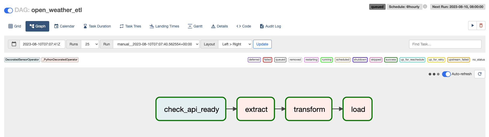
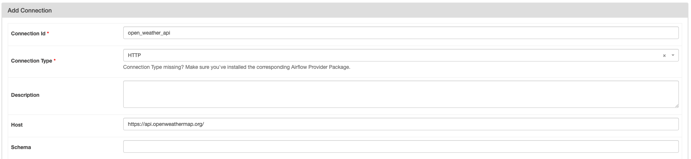
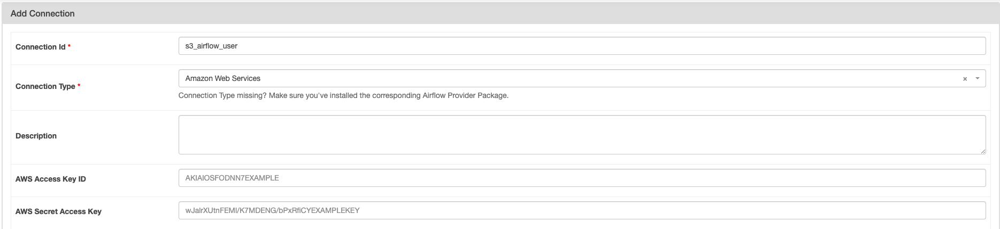

# ETL Data Pipeline With Airflow in Docker

## About
This repo builds an ETL data pipeline ochestrated with Airflow.
It will execute hourly to extract weather data from Open Weather API, transform raw data into specific schema, load the clean data as a csv file and save it to AWS S3 bucket.


## Hosting custom Airflow server in Docker
Different Airflow tasks require different dependencies and Python package. It is also a common requirement to pass variables to be used by Airflow server.

This repo demonstrates builing custom Airflow image, which includes the packages specified in `requirements.txt`, and self defined environment variables specified in `.env`

## Requirements
1. AWS account user with access key and secret
2. Open weather API key. Create here: https://openweathermap.org/api

## Run
1. Create `.env` from `.env.example` and fill in OPEN_WEATHER_API_KEY
2. Spin up airflow server
    ```shell
    docker compose up -d
    ```
    Access Airfllow UI at `localhost:8080` with `airflow` as username and password
3. Add connections on Airflow UI
   1. Open Weather
        
   2. AWS S3
        